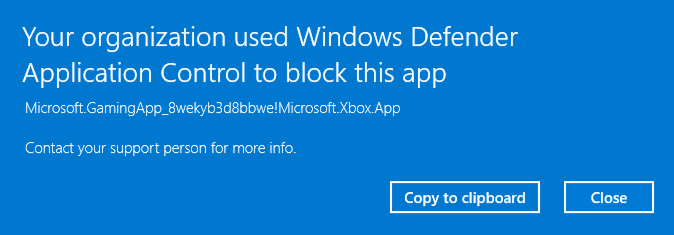

# WDAC-Framework
This is the Beta release of WDAC-Framework, a PowerShell module I created to more easily manage creating, deploying, and editing Windows Defender Application Control policies (what Microsoft is starting to call "App Control for Business"), and the ability to track what Publishers, Certificates, app Hashes, and other "rules" that you trust using a Sqlite database. Rules are easily constructed using file-scans or Windows event log parsing. WDAC Policies can be created with one command -- and optionally merges them with Microsoft recommended rules (including the Microsoft recommended lists of usermode and kernel mode block rules).

There is also the ability to __manage WDAC on remote devices__ using WinRM (remote PowerShell) and SMB file-copying. Create groups of devices, and assign WDAC policies to those groups. (This can be useful if you don't already have a Unified Enpoint Management solution. If you already have a UEM solution like Microsoft Intune, then you might consider using that to manage WDAC remotely rather than using WDAC-Framework.)

WDAC-Framework requires PowerShell 7, and the Sqlite bundle for "Precompiled Binaries for 64-bit Windows (.NET Framework 4.6)" (provided on the Sqlite website: https://system.data.sqlite.org/index.html/doc/trunk/www/downloads.wiki). Additionally, you will need access to the "ConfigCI" suite of PowerShell cmdlets, which is not available on Windows 10 \ Windows 11 home editions (i.e., you will need Windows 10 / Windows 11 Pro or Enterprise editions.)
Obtaining a Sqlite database browser is highly recommended for testing or DB management.

This module makes use of Matthew Graber's ["WDACAuditing" Powershell Module](https://github.com/mattifestation/WDACTools) to easily parse code integrity logs. I've created a wrapper for this module to be able to copy it to remote devices and parse WDAC event logs on remote devices. I've also created a wrapper for Microsoft's `Get-SystemDriver` cmdlet to be able to scan files (locally or remotely) and format the results to mirror the parsed event-log formats of WDACAuditing. 
These parsed file-scans or Windows event logs must then be piped into `Register-WDACEvents` -- and once they are registered, you can begin to decide what file publishers, publishers, file names, certificates, or specific binaries that you trust by piping the result of `Register-WDACEvents` into `Approve-WDACRulesFilter`. (Or, you can check any rules which haven't had trust set using `Approve-WDACRules`). 
You have the ability to "purge" file scan or event log information from the Trust database once you've established trust at higher levels (e.g., publisher, FileName, etc.) There is the ability to create comments to be placed above WDAC rules so you can designate _why_ an app is trusted.

Hopefully this module makes managing WDAC a lot easier for you.
Or, if it doesn't, hopefully it will encourage Microsoft to make WDAC much more easy to manage for sys admins.
If my module doesn't fit your needs, you might try HotCakeX's [WDACConfig module](https://github.com/HotCakeX/Harden-Windows-Security) to see if it will work better for you.

You can fork this repo, incorporate it with open-source or closed-source projects, or do whatever you want with it.

**NOTE 1**: WDAC-Framework is not compatible with single-policy format -- it uses multiple policy format. 
It also is not compatible with these rule levels: WHQLFilePublisher, WHQLPublisher, WHQL, SignedVersion. (But you can still set the WHQL option in a WDAC policy, I'm just talking about rule levels)

**NOTE 2**: While I made a reasonable effort of creating this module so that you could deploy a signed policy without unecessarily blue-screening a device, note that there is always a risk that you can blue-screen a device when using signed policies. This sometimes depends on your device manufacturer. Make sure to deploy WDAC policies on a small number of test devices first.

**NOTE 3**: Make sure a WDAC Policy has been tested in audit mode or on a select number of machines before deploying it in enforced mode on all intended machines.

**NOTE 4**: If you deploy a WDAC policy without setting the "Disabled:Script Enforcement", this will put your device in "Constrained Language Mode", which will limit the type of code that you can execute in PowerShell. This is a great way to lock down PowerShell, but I would recommend doing some serious
Googling about constrained language mode before deploying a WDAC policy for the first time.

**NOTE 5**: This module has only been tested with Windows workstations, not Windows Servers. Use with caution if deploying WDAC policies to Windows Servers.

## Getting Started
Make sure that you have PowerShell 7, and are running on Windows 10 or 11, Pro or Enterprise editions. 
Download the "Precompiled Binaries for 64-bit Windows (.NET Framework 4.6)" .Zip package [from Sqlite.org](https://system.data.sqlite.org/index.html/doc/trunk/www/downloads.wiki) and make note of where you extracted the .Zip.

Then, if your environment has some Windows 10 devices, you will need to download the refresh tool from the Microsoft website. 
https://www.microsoft.com/en-us/download/details.aspx?id=102925
If devices in your environment have more exotic CPU architecture, you may need to download more than one version of the refresh tool. 
Take not of where you downloaded it.
(Note: Downloading the refresh tool is not required if your whole environment consists of Windows 11 devices).

For managing remote devices, you will need to make sure that WinRM (ports 5985 and 5986) and SMB (port 445) is allowed through your firewall(s).
You may need to configure the WinRM service on managed devices.

It's recommended that you obtain a PowerShell code signing certificate. You can create one using your enterprise CA, such as shown [here](https://devblogs.microsoft.com/scripting/hey-scripting-guy-how-can-i-sign-windows-powershell-scripts-with-an-enterprise-windows-pki-part-1-of-2/). The article is partially outdated but the process is similar to creating and signing a WDAC policy signing cert with your enterprise CA (see below.)

__For Signing Policies__
If you want to sign your WDAC policies (which provides the maximum protection for WDAC), then you will need to obtain a policy signing certificate as well as the Microsoft "signtool". 
Instructions for creating a WDAC policy signing certificate are here:
https://learn.microsoft.com/en-us/windows/security/application-security/application-control/app-control-for-business/deployment/create-code-signing-cert-for-appcontrol 

__For Signing Policies (2)__ For obtaining the SignTool.exe file, you will need to install the [Windows SDK](https://developer.microsoft.com/windows/downloads/windows-sdk).
The SignTool should be located in "the \Bin folder of the Microsoft Windows Software Development Kit (SDK) installation path, for example: C:\Program Files (x86)\Windows Kits\10\bin\10.0.19041.0\x64\signtool.exe." [Source](https://learn.microsoft.com/en-us/windows/win32/seccrypto/signtool)

### __Installation Instructions__
Once you've obtained the correct pre-requisites, install the WDAC-Framework module into your "C:\Program Files\WindowsPowerShell\Modules" folder. 
```
Invoke-WebRequest "https://github.com/NathanJepson/WDAC-Framework/archive/refs/heads/main.zip" -OutFile "C:\Program Files\WindowsPowerShell\Modules\WDAC-Framework.zip"

Unblock-File "C:\Program Files\WindowsPowerShell\Modules\WDAC-Framework.zip"

Expand-Archive -Path "C:\Program Files\WindowsPowerShell\Modules\WDAC-Framework.zip" -DestinationPath "C:\Program Files\WindowsPowerShell\Modules\" -Force

Rename-Item -Path "C:\Program Files\WindowsPowerShell\Modules\WDAC-Framework-main" -NewName "WDAC-Framework"
```

Then, you will need to run the setup script. This script will ask you for some of the save locations that you recorded earlier (for the extracted Sqlite assembly, the refresh tool, as well as your SignTool and signing certificates.) It will also ask you where you want to save your Sqlite database, as well as where you want to store your WDAC policies.
```
pwsh "C:\Program Files\WindowsPowerShell\Modules\WDAC-Framework\WDAC-Framework-Setup.ps1"
```

Now, you can import the module. 
```
Import-Module "WDAC-Framework"
```

__Constrained language mode errors with importing the module__: If you run into constrained language mode restrictions when importing--for example if a WDAC policy is already implemented on your device--try signing the "Set-SignedPowerShellModules.psm1" file with your PowerShell signing certificate, importing that module individually and running it. (Your PowerShell code signing certificate must be allowed by your WDAC policies). This will sign all PowerShell files included with WDAC-Framework. Then, try importing the WDAC-Framework module again.

```
$file = 'C:\Program Files\WindowsPowerShell\Modules\WDAC-Framework\Set-SignedPowerShellModules.psm1'
$cert = @(Get-ChildItem cert:\CurrentUser\My -codesigning)[0]
Set-AuthenticodeSignature $file $cert

Import-Module $file
Set-SignedPowerShellModules -Verbose

Remove-Module "Set-SignedPowerShellModules"
Import-Module "WDAC-Framework"
```

## Using the WDAC-Framework Module
You can use this module to create policies, parse code integrity logs or parse file-scan information and then register those logs / file-scan snippets into the database, and methodically verify that you trust them, before you merge them as rules. 

Here's what that can look like. 

Create a new WDAC policy (the "Deny" flag will make it a Deny-by-default policy, or AllowList policy.)
```
New-WDACPolicy -Deny -PolicyName "Cashiers" -Windows -Audit -Unsigned -DynamicCodeSecurity -DisableRuntimeFilepathRules -HVCI -DoNotCacheRecommended -BootMenuProtection -BootAuditOnFailure -AdvancedBootOptionsMenu -ISG
```

Then, create a new group, assign this WDAC policy to the group, and assign a workstation to that group (using the WinRM-compatible hostname of the machine)
```
New-WDACGroup Cashiers
Register-WDACGroup -PolicyName "Cashiers" -GroupName Cashiers
Register-WDACWorkstation -WorkstationName PC1 -GroupName Cashiers
```

Then, deploy that new WDAC policy to the PC1 workstation which is a member of the group you created
```
Deploy-WDACPolicies -PolicyName "Cashiers" Verbose
```

Then, check which apps would be blocked by this policy by parsing code integrity logs, and pipe that into `Register-WDACEvents` and `Approve-WDACRulesFilter`.
Assume that 86b19455-6a4d-40dc-9dcb-8598e3c5eb1a is the PolicyGUID of the "Cashiers" policy in this specific example. Use -purge flag if you want to remove the code integrity event from the database but leave the resultant publisher rule.
```
Get-WDACEvents -MaxEvents 200 -RemoteMachine PC1 -PolicyGUID "86b19455-6a4d-40dc-9dcb-8598e3c5eb1a" -SignerInformation -PEEvents | Register-WDACEvents -Level Publisher -Verbose | Approve-WDACRulesFilter -PolicyGUID "86b19455-6a4d-40dc-9dcb-8598e3c5eb1a" -Level Publisher -Fallbacks Hash -Purge -Verbose
```

When running this, you will see a pseudo-shell console that looks like this:
```
Do you trust the app C:\Users\User1\Downloads\Firefox Installer.exe with SHA256 Flat Hash 93A2AD1E8FEA2402E3C94B18093045C7AB78B8D2067172A9D942031697F73254 ?: ([Y] 
(Yes); [N] (NO); [S] (SKIP); [B] (BLOCK); [/ or COMM] (Add a comment about the app); [A or E] (Expand / View App Info); [C] (Expand / View Certificate + Publisher 
Info); [T] (View Trust for this App for Respective Rule Levels); [V] (Change Specific FileName Level))
Option Selection:
```
You can expand file information (such as the original file name, file version, and authenticode hash, and much more) using "A" or "E".
Use "C" to see information about the signers of the file, including certificate information and TBS hashes.
Then, you can decide to trust the file with "Y", untrust it with "N", skip assigning trust with "S", or block the file with "B". 
Deciding to trust the file will trust the _publisher_ of the file, not just the file itself (unless your selected level was "Hash"). Same idea for if you select "B"--it will block every file from that specific publisher. (A publisher is a combination of 1. Common Name of the LeafCertificate and 2. The issuer certificate).
Trust or Block actions will be assigned to the first-applicable level of your provided Levels (i.e., what you provided to both "Level" and "Fallbacks"). Trust or Block actions cannot be assigned to a file on a specific level if the level doesn't apply to the file.

Then, once you've decided that you've trusted enough apps, you can merge them into the relevant WDAC policy.
```
Merge-TrustedWDACRules -PolicyName Cashiers -Levels Publisher -PreserveBackup -Verbose
```

Then, if you decide that you want this policy to be enforced before deploying it again:
```
Edit-WDACPolicy -PolicyName "Cashiers" -Enforce -Verbose
```

If a policy fails to deploy on a particular device, for example, PowerShell remoting is not available, then you can use the `Restore-WDACWorkstations` cmdlet to fix it later. Additionally, if the `Deploy-WDACPolicies` cmdlet is used with the "-TestComputers" parameter, other non-test devices will be put into a "deferred" state until you use `Restore-WDACWorkstations` to deploy the most recent version on those deferred devices.

Alternatively, you can make an allow-by-default policy (DenyList variant) which allows everything except for apps that you specifically block.
You can create block rules based on the `Get-WDACFiles` cmdlet. (You might try using the FilePublisher or FileName parameter to block specific apps, so that you don't accidentally block all apps from a particular organization using publisher rules.)
```
Get-WDACFiles -RemoteMachine PC1 -NoShadowCopy -ScanPath "C:\Program Files (x86)\Some_Application_You_Want_To_Block" -UserPEs -NoScript -Verbose | Register-WDACEvents -Level FilePublisher -Fallback Publisher -Verbose | Approve-WDACRulesFilter -PolicyGUID "86b19455-6a4d-40dc-9dcb-8598e3c5eb1a" -Level FilePublisher -ApplyRuleEachSigner -Verbose
```

## What even is Windows Defender Application Control?
Windows Defender Application Control (or App Control for Business) is an application control solution which is meant to work with your ["enterprise antivirus solution for a well-rounded enterprise security portfolio"](https://learn.microsoft.com/en-us/windows/security/application-security/application-control/app-control-for-business/appcontrol).

"Application control is often cited as one of the most effective means of defending against malware." ([Source](https://www.microsoft.com/en-us/security/blog/2023/09/21/new-microsoft-security-tools-to-protect-families-and-businesses/))
 
"Application control is a crucial line of defense for protecting enterprises given today's threat landscape, and it has an inherent advantage over traditional antivirus solutions. Specifically, application control moves away from an application trust model where all applications are assumed trustworthy to one where applications must earn trust in order to run." ([Source](https://learn.microsoft.com/en-us/windows/security/application-security/application-control/app-control-for-business/appcontrol))

Basically, WDAC can block untrusted code, or apps which may violate company policy.
For, example, if you decide that the XBox Windows Gaming App (a packaged app or Windows Store app) is not appropriate for company computers,
then you can just block it.



Alternatively, you can use WDAC to block almost any application, exe, dll, (and more), on a Windows workstation except for the apps you specifically trust.

WDAC can help protect your device against APTs and advanced malicious files located on disk.
And -- if you digitally sign your WDAC policy and put it in a specific place in your EFI partition, then
a clever adversary will have difficulty removing the policy even with admin permissions (unless they can obtain the private key).

Sys Admins can use WDAC in BlockList or AllowList varieties.
A BlockList app control policy will only block specific apps, DLLs, MSIs, etc. that you _want_ to block.
An Allowlist app control policy will block _everything_ except for things you specifically allow.

App Control for Business only applies to [very specific file types](https://learn.microsoft.com/en-us/windows/security/application-security/application-control/app-control-for-business/feature-availability). App Control for Business cannot control files such as Java files and Python scripts, but you
still have control over whether Java or Python itself can run on a workstation.

And, Microsoft has promised us that App Control for Business will receive many more improvements compared with AppLocker, which ["isn't getting new feature improvements."](https://learn.microsoft.com/en-us/windows/security/application-security/application-control/app-control-for-business/appcontrol-and-applocker-overview)

## Why create this module in the first place?
Microsoft does create and maintain the "ConfigCI" suite of PowerShell cmdlets, which you can use to create WDAC policies, and merge WDAC rules. There are a few problems with it though. 
Using New-CIPolicy creates a policy based on _every_ code integrity event log, and chops off information that you might need to decide whether to trust it or not. Some of this information would include the process that attempted to run the file, as well as the FlatHash of the file--if it's a portable executable, which might be useful to look-up on VirusTotal. (Often, the ConfigCI cmdlets only spit out the authenticode hash for portable executable files, which cannot be used to look-up a file on VirusTotal).

Additionally, when merging WDAC policy rules, comments which you might've put above the rules will disappear. 
Addtionally, when merging WDAC policies, the HVCI setting you have might be set back to "0". 

The other reason I created this module is so I could more easily track what policies have been deployed on which devices (since the CiTool is currently only available on Windows 11 devices). I also needed a way to track which devices have received their initial restart, if deployed policies are signed policies. (When deploying a signed policy, you will need to restart the device initially rather than using the refresh tool.)

And finally, it is mildly annoying that whenever you use the `Merge-CIPolicy` cmdlet from ConfigCI, that it appends an "_0" or a "_1" to all your rules. 
I've created a cmdlet which gets rid of the extraneous underscore + digits from rule IDs whenever there aren't collisions: `Update-WDACRuleIDs`

Microsoft maintains a project called the ["WDAC Wizard"](https://github.com/MicrosoftDocs/WDAC-Toolkit) which can be used to create and modify WDAC policies, but it doesn't have the automation that I would like, especially when I urgently need to block or allow something quickly.

## Known Issues
- There is currently an issue with using `Merge-TrustedWDACRules` in certain scenarios (including when merging FilePublisher rules).
The error is:
`System.Management.Automation.RuntimeException: Cannot bind parameter 'Rules'. Cannot convert value "Microsoft.SecureBoot.UserConfig.Rule" to type "Microsoft.SecureBoot.UserConfig.Rule". Error: "Cannot convert hashtable to an object of the following type: Microsoft.SecureBoot.UserConfig.Rule. Hashtable-to-Object conversion is not supported in constrained language mode, restricted language mode or a Data section.` 
There is a workaround if you import the WDAC-Framework module into a trusted PowerShell script and run the `Merge-TrustedWDACRules` cmdlet in the same script. (Rather than in the PowerShell console.) If you can find a way to fix this, let me know.
Note: You have to invoke the workaround script with `pwsh` rather than using dot-slash `.\` to run it.

- Additionally, I haven't yet implemented a way to successfully implement custom comments for file-publisher rules. 

- Additionally, WDAC-Framework currently only handles cases for when the `Enabled:Update Policy No Reboot` option is set in a WDAC policy. When deploying, the
refresh tool is used (unless a signed policy is being removed, or a signed policy is deployed for the first time.)

## Interesting Problems I ran into when making this project
- For some reason, when creating a new Microsoft.SecureBoot.UserConfig.Rule object for a publisher or certificate rule, it doesn't let you create the object without the relevant X509Certificate2 object, even when you already know the TBS hash of the certificate, so I created a workaround which uses temporary publisher / certificate placeholders (.XML files), and using the `Get-CIPolicy` cmdlet on these files, after replacing placeholder information with the correct TBS hashes and publisher names

- When parsing event logs from multiple devices, there is a possibility that you can get different versions of the same app (or, nearly identical file publishers except for different file version numbers). To account for this, I created options to handle "versioning behavior" in the Approve-WDACRules cmdlet. A lot of it is real spaghetti code, but at least you get the option whether to automatically increment or decrement the minimum version number, or choose it each time, among other options.

- Testing whether something was already blocked or trusted at a higher rule level, thus allowing you to skip those apps when they are piped into Approve-WDACRulesFilter or iterated over using Approve-WDACRules. I created a few background functions to accomplish this (Test-AppTrusted and Test-AppBlocked)

- There were several uses of ConfigCI which only work in PowerShell 5. For example, when creating new Microsoft.SecureBoot.UserConfig.Rule objects ($rules), and merging them into a WDAC policy with `Merge-CIPolicy -Rules $rules`, this does not work in PowerShell 7. (ConfigCI has [yet to be certified for PowerShell 7](https://learn.microsoft.com/en-us/powershell/windows/module-compatibility?view=windowsserver2022-ps).) As a workaround, there are several places where I wrapped things in PowerShell 5 blocks. In some cases, this does look ugly, but it works.

- When deploying a signed base policy to a device for the first time, it's important to restart it without using the refresh tool. (Or, at least, [when memory integrity is enabled on the device](https://learn.microsoft.com/en-us/windows/security/application-security/application-control/app-control-for-business/deployment/appcontrol-deployment-guide), see note labeled "Important".) Then, supsequent updates to the policy can use the refresh tool without a restart. Additionally, you will need to restart devices after removing a signed policy. Knowing how to keep track of whether a device needs to be restarted or not, or received its initial restart for a particular policy, was another interesting problem. I created a SQL table to track "first_signed_policy_deployments" to solve the first problem, and I also have functions to check whether a signed policy is being removed to address the second problem.

- Another interesting problem I ran into is this: when using `Copy-Item` to copy a file to a remote machine, this won't work if Constrained Language Mode is enabled on the remote machine (so, if basically any WDAC policy is deployed on the remote machine.) You can get around this by copying files with using the UNC path of a remote directory (for example, `\\RemoteMachine\c$\RemoteFolder`). Using this format of a remote file path will allow you to copy files using SMB, rather than using Windows Remote Management (`Copy-Item` to remote machines using WinRM doesn't work in constrained language mode environments)

## Possible future additions to WDAC-Framework

- Create an automated "trust engine" which will allow you to automatically trust new rules if the app information from `Get-WDACEvents` or `Get-WDACFiles` matches certain patterns or regex. The "trust engine" could use incorporate external libraries if desired (such as VirusTotal plugins)

- Use of commit tools to, for example, sync your Trust database or WDAC policies with an AWS S3 bucket

- Explicit blocking for lower file publisher versions when you trust a file publisher rule

- Allow a "full skip" in `Approve-WDACRules` which will set a skip attribute on all files which match the highest designated rule level